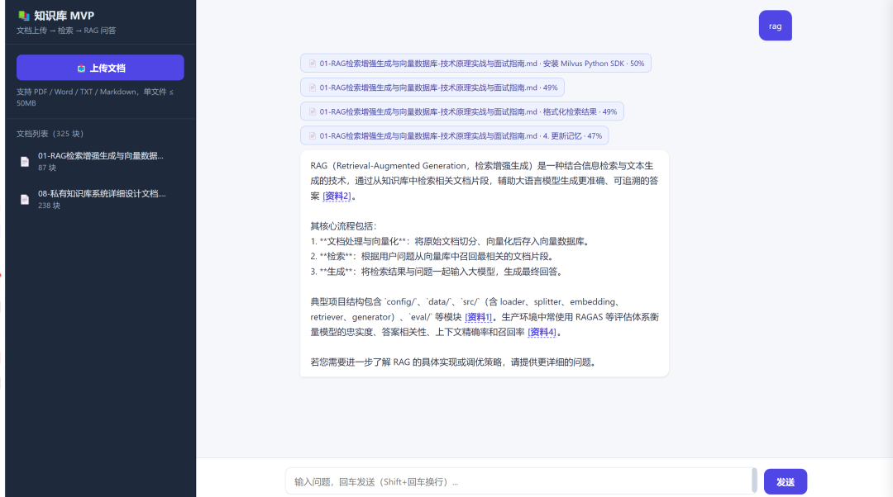
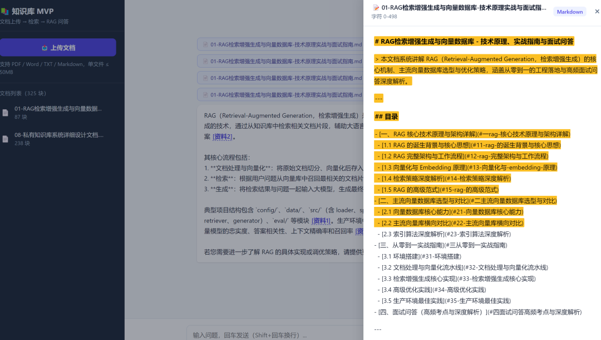

<div align="center">

# 📚 KB-MVP

### 轻量级 RAG 知识库问答系统

文档上传 → 解析分块 → 向量存储 → 检索增强生成（RAG）问答的完整闭环。
前后端分离，单机本地运行，零外部中间件，支持多供应商模型灵活切换。


</div>

---

## 📖 项目简介

KB-MVP 是一个轻量级的私有知识库问答系统，基于检索增强生成（RAG）技术构建。用户上传文档后，系统自动完成解析、分块、向量化入库，随后即可基于文档内容进行智能问答——答案附带可点击的来源引用，点击即可定位到原文并高亮显示。

**设计理念：**

- **零配置快速运行**：普通个人电脑一键启动，无需安装数据库、无需本地 GPU
- **多供应商模型适配**：LLM 与 Embedding 均抽象为通用适配层，支持 DashScope / DeepSeek / GLM / Ollama / OpenAI 兼容端点无缝切换
- **本地化优先**：通过 Ollama 可完全本地运行（LLM + Embedding），零 API 费用、零网络依赖
- **答案可溯源**：答案中的引用标识可点击，弹出文档预览并高亮命中片段，构建"问答 → 引用 → 原文"的完整信任链路

---

## 📸 项目预览

### RAG 问答界面与引用链接



- 左侧：文档列表（支持上传与删除），实时显示已入库块数
- 中间：对话区，助手答案流式输出，`[资料N]` 引用自动渲染为可点击链接
- 上方：来源标签卡片（文档名 · 页码/章节 · 相似度百分比）

### 文档预览与引用高亮



- 点击 `[资料N]` 引用链接后，右侧弹出文档预览抽屉
- 顶部：文档类型徽章 + 文档名称 + 字符区间定位信息
- 下方：按 blocks 渲染文档全文，命中片段黄色高亮（闪烁动画）并自动滚动居中

---

## ✨ 核心特性

| 特性 | 说明 |
|------|------|
| **完整 RAG 闭环** | 文档上传 → 解析 → 分块 → 向量化 → 语义检索 → 流式生成 |
| **多供应商模型适配** | LLM 与 Embedding 独立配置，支持 5 类供应商，新增供应商只需扩展一个子类 |
| **本地化运行** | 通过 Ollama 完全本地运行，零 API 费用、零网络依赖 |
| **答案溯源** | `[资料N]` 引用转为可点击链接，点击弹出文档预览并高亮命中片段 |
| **零外部中间件** | 向量存储用 numpy + JSON，无需 MySQL / Redis / Milvus |
| **零构建前端** | 原生 HTML / CSS / JS 单文件，响应式适配移动端与桌面端 |
| **向量一致性保护** | 切换 Embedding 供应商时自动校验，防止向量空间混用 |

---

## 🏗️ 系统架构

```
┌──────────────────────────────────────────────────────────────┐
│                      浏览器（前端单页）                         │
│   文档上传 · 对话问答 · [资料N] 引用点击溯源 · 文档预览高亮      │
└────────────────────────────┬─────────────────────────────────┘
                             │ HTTP / SSE
                             ▼
┌──────────────────────────────────────────────────────────────┐
│                   FastAPI 应用（单进程）                       │
│  ┌──────────┐  ┌──────────────┐  ┌────────────────────────┐  │
│  │ 静态资源  │  │  API 路由层   │  │      RAG 引擎          │  │
│  │ 托管前端  │  │ upload/ask/  │  │ 检索→构造Prompt→生成    │  │
│  └──────────┘  └──────┬───────┘  └───────────┬────────────┘  │
│                       │                      │               │
│       ┌───────────────┼──────────────────────┘               │
│       ▼               ▼                                      │
│  ┌─────────┐   ┌──────────────┐   ┌──────────────────────┐   │
│  │文档解析  │   │  向量存储     │   │  模型适配层（通用）   │   │
│  │PDF/Word │   │ numpy+JSON   │   │  ┌────────────────┐  │   │
│  │/TXT/MD  │   │ +一致性校验   │   │  │ LLM 适配器     │  │   │
│  └─────────┘   └──────────────┘   │  │ Embedding 适配器│  │   │
│                                   │  └───────┬────────┘  │   │
│                                   └──────────┼───────────┘   │
└──────────────────────────────────────┼───────────────────────┘
                                       │
            ┌──────────────────────────┼──────────────────────┐
            ▼                          ▼                      ▼
   ┌─────────────────┐      ┌──────────────────┐    ┌─────────────────┐
   │  DashScope API   │      │  DeepSeek / GLM  │    │  Ollama 本地    │
   │ 通义千问 LLM/Emb │      │  OpenAI 兼容 API │    │  LLM / Embedding│
   └─────────────────┘      └──────────────────┘    └─────────────────┘
                                       │
                                       ▼
                          ┌────────────────────────┐
                          │     本地文件系统         │
                          │  data/docs/  原始文档    │
                          │  data/store/ 向量库      │
                          └────────────────────────┘
```

**架构分层：**

| 层次 | 职责 | 组件 |
|------|------|------|
| 表现层 | 用户交互、问答展示 | 单页 HTML |
| 接口层 | HTTP 路由、SSE 流式响应 | FastAPI Router |
| 引擎层 | RAG 编排（检索→提示词→生成） | RAGEngine |
| 能力层 | 解析、向量化、检索、LLM 调用 | DocumentLoader / Embedding / VectorStore / LLM 适配器 |
| 存储层 | 向量与文档本地持久化 | JSON 文件 + 文件系统 |
| 外部服务 | 远程/本地模型能力 | 多供应商模型 API |

---

## 📁 项目结构

```
kb-mvp/
├── README.md                    # 项目说明（本文件）
├── LICENSE                      # MIT 许可证
├── requirements.txt             # 依赖清单
├── .env.example                 # 环境变量示例（复制为 .env 使用）
├── .gitignore
├── start.bat                    # Windows 一键启动脚本
├── start.sh                     # macOS/Linux 一键启动脚本
│
├── app/                         # 后端应用（FastAPI）
│   ├── __init__.py
│   ├── main.py                  # 应用入口：启动 FastAPI、挂载前端
│   ├── config.py                # 配置加载（多供应商 .env 解析）
│   ├── api.py                   # API 路由层
│   ├── rag_engine.py            # RAG 引擎（核心编排）
│   ├── document_loader.py       # 文档解析模块（含位置信息）
│   ├── text_splitter.py         # 文本分块模块（含 locator）
│   ├── embedding.py             # 向量化服务（薄包装，委托适配层）
│   ├── embedding_provider.py    # Embedding 通用适配层（多供应商）
│   ├── vector_store.py          # 向量存储与检索（numpy + 一致性校验）
│   ├── llm.py                   # LLM 调用服务（薄包装，委托适配层）
│   └── llm_provider.py          # LLM 通用适配层（多供应商）
│
├── static/                      # 前端静态资源
│   └── index.html               # 单页前端界面（含引用链接与溯源预览）
│
├── docs/                        # 项目文档
│   ├── screenshots/             # 界面截图
│   │   ├── screenshot-01-qa-interface.png
│   │   └── screenshot-02-doc-preview.png
│   ├── 技术选型对比分析报告.md    # 技术栈多维度对比评估
│   ├── 企业级架构设计参考文档.md  # 企业级落地架构指引
│   └── RAG技术复用与业务扩展指南.md # 业务扩展参考（推荐系统等场景）
│
└── data/                        # 运行时数据（自动创建，不入版本库）
    ├── docs/                    # 上传的原始文档
    └── store/                   # 向量库持久化
        ├── vectors.json         # 全量向量记录（含 locator + 元信息）
        └── documents/           # 文档结构化内容（溯源预览依据）
```

---

## 🚀 快速启动

### 运行前置条件

| 条件 | 说明 |
|------|------|
| **Python 3.10+** | 已安装并加入 PATH |
| **网络** | 首次安装依赖需联网；使用线上模型时需联网 |
| **模型 API Key** | 使用线上供应商（DashScope/DeepSeek/GLM）时需要；本地 Ollama 无需 |

### 方式一：一键启动（推荐）

**Windows**：双击 `start.bat`

**macOS / Linux**：
```bash
chmod +x start.sh
./start.sh
```

脚本自动完成：环境检测 → 虚拟环境创建 → 依赖安装 → 配置初始化 → 启动服务。首次运行会从 `.env.example` 复制生成 `.env`，请按下方配置说明填入模型配置后重新运行。

### 方式二：手动启动

```bash
# 1. 克隆仓库
git clone https://github.com/your-username/kb-mvp.git
cd kb-mvp

# 2. 创建虚拟环境
python -m venv .venv

# 3. 激活虚拟环境
#    Windows:
.venv\Scripts\activate
#    macOS/Linux:
source .venv/bin/activate

# 4. 安装依赖
pip install -r requirements.txt

# 5. 配置环境变量
cp .env.example .env
#    编辑 .env（见下方配置说明）

# 6. 启动服务
python -m app.main
```

启动后访问：

- **前端界面**：<http://127.0.0.1:8000>
- **API 文档**：<http://127.0.0.1:8000/docs>

---

## ⚙️ 配置说明

编辑 `.env` 文件。LLM 与 Embedding 配置完全独立、互不干扰。

### LLM 对话模型

| 配置项 | 说明 | 默认值 |
|--------|------|--------|
| `LLM_PROVIDER` | LLM 供应商：`dashscope` / `deepseek` / `glm` / `ollama` / `openai_compatible` | dashscope |
| `LLM_MODEL` | 模型名称（按供应商选择） | qwen-plus |
| `LLM_API_KEY` | API Key（dashscope 可留空回退 `DASHSCOPE_API_KEY`；ollama 本地留空） | — |
| `LLM_API_BASE` | API Base URL（留空用供应商默认；`openai_compatible` 必填） | — |

### Embedding 向量化模型

| 配置项 | 说明 | 默认值 |
|--------|------|--------|
| `EMBEDDING_PROVIDER` | Embedding 供应商：`dashscope` / `ollama` / `openai_compatible` / `deepseek` / `glm` | dashscope |
| `EMBEDDING_MODEL` | 模型名称 | text-embedding-v2 |
| `EMBEDDING_API_KEY` | API Key（同上回退规则） | — |
| `EMBEDDING_API_BASE` | API Base URL | — |

### 检索与分块

| 配置项 | 说明 | 默认值 |
|--------|------|--------|
| `CHUNK_SIZE` | 分块字符数 | 500 |
| `CHUNK_OVERLAP` | 块间重叠字符数 | 50 |
| `TOP_K` | 检索返回片段数 | 4 |
| `SERVER_PORT` | 服务端口 | 8000 |

> **向后兼容**：`DASHSCOPE_API_KEY` 在 `dashscope` 供应商下自动回退使用。

---

## 🧩 模型供应商切换示例

### 通义千问 DashScope（线上）
```bash
LLM_PROVIDER=dashscope
LLM_MODEL=qwen-plus
EMBEDDING_PROVIDER=dashscope
EMBEDDING_MODEL=text-embedding-v2
DASHSCOPE_API_KEY=sk-xxxxxxxx
```

### DeepSeek 对话 + 本地向量化（混合）
```bash
LLM_PROVIDER=deepseek
LLM_MODEL=deepseek-chat
LLM_API_KEY=sk-xxxxxxxx
EMBEDDING_PROVIDER=ollama
EMBEDDING_MODEL=nomic-embed-text
```

### 智谱 GLM
```bash
LLM_PROVIDER=glm
LLM_MODEL=glm-4
LLM_API_KEY=xxxxxxxx
EMBEDDING_PROVIDER=glm
EMBEDDING_MODEL=embedding-3
EMBEDDING_API_KEY=xxxxxxxx
```

### Ollama 完全本地（零 API 费用）
前置：安装 [Ollama](https://ollama.com/) 并拉取模型：
```bash
ollama pull qwen2.5:7b          # LLM
ollama pull nomic-embed-text    # Embedding（英文）/ bge-m3（中文更佳）
```
```bash
LLM_PROVIDER=ollama
LLM_MODEL=qwen2.5:7b
EMBEDDING_PROVIDER=ollama
EMBEDDING_MODEL=nomic-embed-text
# 本地部署无需 API Key，默认端点 http://localhost:11434/v1
```

### 任意 OpenAI 兼容端点
```bash
LLM_PROVIDER=openai_compatible
LLM_MODEL=your-model
LLM_API_KEY=sk-xxxxxxxx
LLM_API_BASE=https://your-endpoint/v1
```

> **向量一致性保护**：切换 Embedding 供应商后，旧向量与新查询向量空间不兼容。系统在 `vectors.json` 记录入库时的供应商/模型/维度，检索前自动校验，不一致时拦截并提示清空 `data/store/vectors.json` 后重新入库，避免返回错误结果。

---

## 📡 API 接口

| 方法 | 路径 | 说明 |
|------|------|------|
| POST | `/api/upload` | 上传文档入库（multipart） |
| POST | `/api/ask` | RAG 问答（SSE 流：sources → token… → done） |
| GET | `/api/documents` | 文档列表（含向量库 embedding 元信息） |
| DELETE | `/api/documents/{doc_id}` | 删除文档（同步清理向量与结构化内容） |
| GET | `/api/documents/{doc_id}/content` | 获取文档结构化内容（溯源预览渲染） |
| GET | `/api/documents/{doc_id}/chunk/{chunk_id}` | 获取块定位信息（引用高亮） |
| GET | `/api/models` | 查询当前 LLM / Embedding 供应商与模型配置 |
| GET | `/docs` | OpenAPI 交互式文档 |

### 问答接口示例（SSE 流）

```
POST /api/ask
Content-Type: application/json

{"question": "退款政策是什么？"}

# 响应（text/event-stream）
data: {"type":"sources","data":[{"doc_id":"...","doc_name":"产品手册.pdf","chunk_id":"..._3","score":0.89,"locator":{...}}]}
data: {"type":"token","data":"根"}
data: {"type":"token","data":"据"}
data: {"type":"token","data":"资料"}
...
data: {"type":"done"}
```

---

## 🖥️ 功能使用

1. **上传文档**：左侧栏点击「上传文档」，支持 PDF / Word / TXT / Markdown
2. **智能问答**：输入框输入问题，回车发送，答案流式输出
3. **引用溯源**：答案中的 `[资料N]` 为可点击链接，点击弹出文档预览窗口——顶部显示文档类型与名称，下方高亮定位引用片段并自动滚动
4. **来源标签**：答案上方来源标签同样可点击查看原文
5. **文档管理**：左侧栏文档列表，悬停显示删除按钮

---

## 🛠️ 技术栈

| 层次 | 选型 |
|------|------|
| **后端框架** | Python 3.10+ / FastAPI / Uvicorn |
| **文档解析** | PyMuPDF（PDF）/ python-docx（Word） |
| **模型适配** | dashscope SDK + openai SDK（覆盖 DeepSeek/GLM/Ollama 等 OpenAI 兼容端点） |
| **向量存储** | numpy 矩阵化余弦检索 + JSON 持久化 |
| **前端** | 原生 HTML / CSS / JavaScript（零构建，响应式） |
| **配置** | python-dotenv + .env |

### 依赖清单（9 个直接依赖，全部轻量跨平台）

`fastapi` · `uvicorn[standard]` · `python-multipart` · `dashscope` · `openai` · `PyMuPDF` · `python-docx` · `numpy` · `python-dotenv`

---

## 📐 核心设计

- **模型适配层**：`llm_provider.py` / `embedding_provider.py` 定义抽象基类与具体实现，工厂函数按配置实例化，符合开闭原则，新增供应商只需实现一个子类并在工厂注册
- **溯源定位**：解析阶段记录 `char_start/char_end`，分块阶段继承为 `locator`（页码/段落/行号/章节），贯穿检索→来源→前端高亮，确保「点击引用 → 打开文档 → 高亮片段」闭环
- **向量一致性校验**：防止切换 Embedding 供应商后向量空间混用导致检索失真
- **流式渲染**：LLM 走 SSE 流式输出，前端逐 token 渲染，引用标识实时解析为可点击链接（兼容 token 分割）

---

## 📄 扩展文档

项目 `docs/` 目录提供三份深度技术文档，为本项目的技术决策、企业级演进与业务扩展提供完整参考：

| 文档 | 说明 |
|------|------|
| [🔍 技术选型对比分析报告](./docs/技术选型对比分析报告.md) | 从性能、扩展性、安全性、维护成本四维度评估 11 类技术栈（后端/前端/数据库/向量库/搜索引擎/缓存/消息队列/对象存储/LLM推理/容器编排/监控），含多维度评分与选型结论 |
| [🏢 企业级架构设计参考文档](./docs/企业级架构设计参考文档.md) | 面向企业级落地的架构指引，涵盖高可用架构、数据容灾备份、权限与角色管控（RBAC+ABAC+ACL）、监控告警体系、平滑升级策略五大核心模块 |
| [🚀 RAG 技术复用与业务扩展指南](./docs/RAG技术复用与业务扩展指南.md) | 本项目技术栈复用于其他业务场景的实践指南，以智能商品推荐为典型案例，拆解数据处理/查询交互/搜索匹配三端转化流程，对比数据颗粒度、意图解析、排序策略三大差异，附 7 种扩展场景与快速上手步骤 |

---

## ❓ 常见问题

<details>
<summary><b>切换 Embedding 供应商后问答报错怎么办？</b></summary>

不同供应商的向量空间不兼容。删除 `data/store/vectors.json` 后重新上传文档入库即可。系统内置一致性校验会主动提示。
</details>

<details>
<summary><b>Ollama 模型如何安装？</b></summary>

```bash
# 安装 Ollama 后拉取模型
ollama pull qwen2.5:7b          # 对话模型
ollama pull nomic-embed-text    # 向量模型
```
默认端点 `http://localhost:11434/v1`，无需额外配置。
</details>

<details>
<summary><b>支持哪些文档格式？</b></summary>

PDF（`.pdf`）、Word（`.docx`/`.doc`）、纯文本（`.txt`）、Markdown（`.md`/`.markdown`）。单文件建议 ≤ 50MB。
</details>

<details>
<summary><b>数据存储在哪里？</b></summary>

全部本地存储：原始文档在 `data/docs/`，向量库在 `data/store/vectors.json`，文档结构化内容在 `data/store/documents/`。重启不丢失。
</details>

---

## 🔒 安全注意事项

- `.env` 含 API Key，已加入 `.gitignore`，**严禁提交版本库**
- `data/` 含上传文档与向量，已加入 `.gitignore`，不入版本库
- 本项目不实现任何鉴权，**严禁暴露到公网**，仅在 `127.0.0.1` 访问
- 使用线上模型时，上传文档原文会发送至对应供应商，敏感文档不建议处理
- 建议使用子账号 Key 并设置调用额度限制

---

## 🗺️ 路线图

- [x] 文档上传与解析（PDF/Word/TXT/Markdown）
- [x] 递归文本分块与向量化入库
- [x] 语义检索与 RAG 流式问答
- [x] 答案引用溯源与文档预览高亮
- [x] 多供应商模型适配（DashScope/DeepSeek/GLM/Ollama）
- [x] 移动端响应式布局
- [ ] 多轮对话上下文记忆
- [ ] 文档增量更新
- [ ] Excel / PPT 格式支持
- [ ] 混合检索（稠密 + 稀疏）

---

## 🤝 贡献指南

欢迎贡献代码、报告问题或提出建议！

### 贡献流程

1. **Fork** 本仓库
2. 创建特性分支：`git checkout -b feature/your-feature`
3. 提交更改：`git commit -m 'feat: 添加某功能'`
4. 推送分支：`git push origin feature/your-feature`
5. 提交 **Pull Request**

### 开发规范

- 遵循现有代码风格（Python 遵循 PEP 8）
- 新增功能请确保不破坏现有流程
- 新增模型供应商：在 `llm_provider.py` 或 `embedding_provider.py` 实现子类并在工厂函数注册
- 提交信息格式：`<type>: <description>`（如 `feat:` / `fix:` / `docs:` / `refactor:`）

### 报告问题

提交 [Issue](../../issues) 时请包含：
- 操作系统与 Python 版本
- 复现步骤
- 期望结果与实际结果
- 错误日志（脱敏后）

---

## 📄 许可证

本项目基于 [MIT License](./LICENSE) 开源，可自由使用、修改和分发。

---

<div align="center">

如果这个项目对你有帮助，欢迎 ⭐ Star 支持！

</div>
